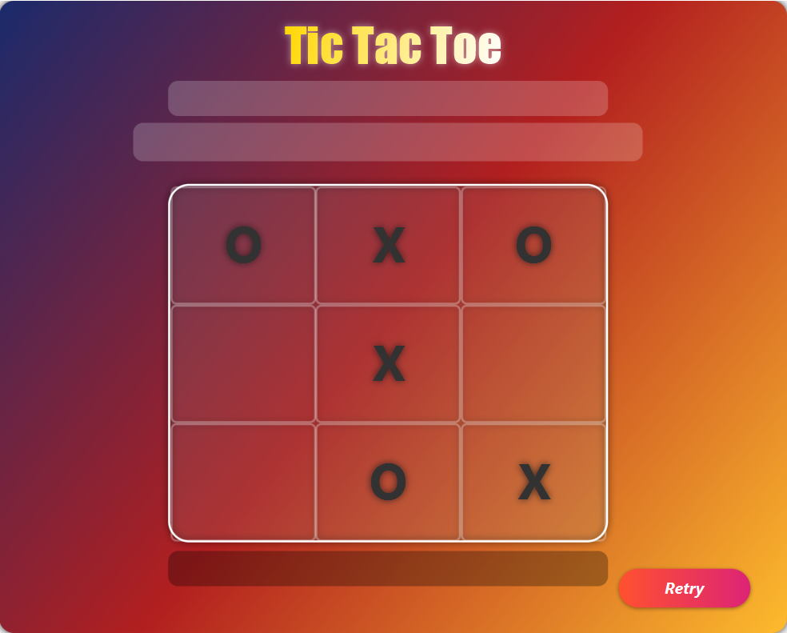

# 🎮 Tic Tac Toe Game (JavaFX)

A modern **Tic Tac Toe** desktop game built using **JavaFX**, featuring a clean UI, human vs AI gameplay, and an AI player powered by the **Minimax algorithm**.

---

## 📌 Features

* ✅ JavaFX-based modern UI (FXML + CSS styling)
* 🤖 Human vs AI gameplay
* 🧠 AI implemented using **Minimax algorithm** (unbeatable)
* 🔁 Retry / Restart game option
* ⚠️ Invalid move handling
* 🏆 Win / Lose / Draw detection

---

## 🛠️ Technologies Used

* **Java 17+**
* **JavaFX**
* **FXML**
* **OOP Principles**
* **MVC Architecture**

---

## 🧩 Project Structure

```text
src/main/java/com/ijse/gdse72/tictactoy
│
├── controller
│   └── BoardUiController.java
│
├── service
│   ├── AiPlayer.java
│   ├── HumanPlayer.java
│   ├── Board.java
│   ├── BoardImpl.java
│   ├── Player.java
│   ├── Piece.java
│   └── Winner.java
│
└── Main.java

src/main/resources
└── view
    └── board-ui.fxml
```

---

## 🎯 Gameplay Logic Overview

* Human always plays as **X**
* AI plays as **O**
* User clicks on an empty cell to place `X`
* AI automatically responds with the best possible move
* Game ends when:

    * A player wins
    * Board is full (Draw)

---

## 🧠 AI Logic (Minimax)

The AI evaluates all possible game states using the **Minimax algorithm**:

* AI tries to **maximize** its score
* Human tries to **minimize** AI’s score
* Depth is considered to prioritize faster wins

```java
if (winner.winningPiece == Piece.O) return 10 - depth;
if (winner.winningPiece == Piece.X) return depth - 10;
```

This makes the AI **unbeatable**.

---

## 🖥️ UI Preview



---

## ▶️ How to Run the Project

1. Clone the repository

   ```bash
   git clone https://github.com/your-username/tic-tac-toe-javafx.git
   ```

2. Open the project in **IntelliJ IDEA** or **NetBeans**

3. Make sure JavaFX is properly configured

4. Run `Main.java`

---

## 🔁 Future Improvements

* 🔊 Sound effects
* 🎨 Theme switching
* 🌐 Online multiplayer
* 📊 Score history

---

## 👨‍💻 Author

**Tharusha Sandaruwan**
GDSE Student | IJSE

---

## 📄 License

This project is for **educational purposes only**.
